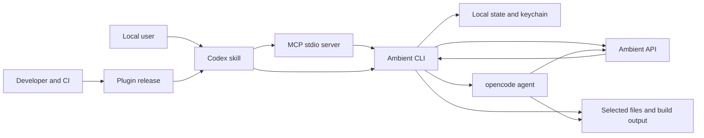

# Ambient Codex Threat Model

## Executive summary

Ambient Codex is a local, single-user Codex plugin that sends user-selected
prompts and source code to Ambient's external inference API. Its highest risks
are accidental source/secret disclosure and unsafe use of untrusted generated
output, especially in the opencode agent lane where the normal secret tripwire
does not inspect the working tree. Existing host pinning, namespaced key storage,
bounded MCP schemas, path validation, spend gates, and review-oriented skill
instructions materially reduce risk. No critical threat is identified for the
confirmed general-public local-use scope; agent isolation and release supply-chain
integrity deserve the most continued scrutiny.

## Scope and assumptions

- In scope: `plugins/ambient-codex/.codex-plugin/`,
  `plugins/ambient-codex/.mcp.json`, `plugins/ambient-codex/bin/ambient`,
  `plugins/ambient-codex/mcp/`, `plugins/ambient-codex/skills/`,
  `plugins/ambient-codex/hooks/`, plugin documentation, tests, and
  `.github/workflows/ci.yml`.
- Intended usage: members of the public install the plugin locally to use Ambient
  models from Codex for asks, audits, builds, repository maps, and agent sessions.
- Deployment: one local OS user and one Codex installation; MCP is local stdio,
  while inference is outbound HTTPS. There is no inbound server or multi-tenancy.
- Data sensitivity: ordinary prompts and source code may be sent. Credentials,
  PHI, regulated data, production dumps, and unrelated private data are unsupported
  and explicitly excluded (`plugins/ambient-codex/PRIVACY.md`).
- Authentication: Ambient authenticates requests with the user's own API key.
  Local authorization relies on the OS user boundary and Codex tool approval.
- Out of scope: Ambient's hosted infrastructure, opencode internals, compromised
  operating systems, attackers already able to act as the same OS user, and
  deliberate user approval of a hostile custom endpoint.
- CI/build tooling is considered separately from runtime. Tests are intended to
  be hermetic; release publishing remains an operator-controlled Git action.

Open questions that would materially change these rankings:

- Reassess before supporting shared CI runners, multi-user hosts, regulated data,
  unattended production automation, or centrally managed enterprise deployment.

## System model

### Primary components

- **Codex skill:** orchestration and trust policy for delegation, takeover,
  massive-repository sharding, and final verification
  (`plugins/ambient-codex/skills/ambient/SKILL.md`).
- **MCP control plane:** bounded JSON-RPC-over-stdio tools with schema validation,
  redaction, framing limits, and subprocess isolation
  (`plugins/ambient-codex/mcp/ambient_mcp.py`).
- **CLI execution plane:** stdlib Python entrypoint for configuration, key access,
  API calls, input packing, audits, builds, spend controls, and integrations
  (`plugins/ambient-codex/bin/ambient`).
- **Local state:** namespaced configuration, cache, usage, reservations, and
  capability data under `~/.config/ambient-codex`, plus an `ambient-codex`
  keychain item (`plugins/ambient-codex/bin/ambient`: `_state_dir`,
  `KEYCHAIN_SERVICE`).
- **External inference:** OpenAI-compatible HTTPS chat-completion and model
  endpoints authenticated with a bearer key
  (`plugins/ambient-codex/bin/ambient`: `api_request`, `stream_completion`).
- **Agent integration:** opencode subprocess with a namespaced provider entry and
  key supplied through the child environment (`plugins/ambient-codex/bin/ambient`:
  `ensure_opencode_config`, `cmd_agent`).
- **Build/release:** local marketplace metadata and a cross-platform GitHub Actions
  test/lint/plugin matrix (`.agents/plugins/marketplace.json`,
  `.github/workflows/ci.yml`).

### Data flows and trust boundaries

- User/Codex → MCP server: prompts, paths, settings, and mode/model choices cross
  local stdio JSON-RPC. MCP enforces types, lengths, choices, unknown-field
  rejection, an 8 MiB frame cap, and NUL rejection. No network authentication is
  needed because there is no listener
  (`plugins/ambient-codex/mcp/ambient_mcp.py`: `call_tool`, `read_message`,
  `MAX_FRAME_BYTES`).
- MCP server → bundled CLI: validated arguments cross a Python subprocess argv
  boundary. Dynamic text is placed after `--`; no shell is used, execution has a
  timeout, and output is redacted
  (`plugins/ambient-codex/mcp/ambient_mcp.py`: `run_ambient`, `ask_tool`,
  `audit_small_tool`).
- CLI → local state/keychain: credentials and settings cross an OS filesystem or
  keychain boundary. State roots are namespaced, foreign Ambient trees are
  rejected, files use restrictive modes and atomic replacement where applicable
  (`plugins/ambient-codex/bin/ambient`: `validate_state_root`, `resolve_key_and_backend`,
  `save_config_values`).
- CLI → Ambient API: selected prompts/code and the bearer key cross outbound HTTPS.
  Ambient hosts are pinned by default; a non-Ambient endpoint requires a persisted,
  typed trust decision, and POST completions are not blindly retried
  (`plugins/ambient-codex/bin/ambient`: `resolve_api_url`, `cmd_trust_url`,
  `api_request`). The plugin
  adds no client-side request-rate limiter; local spend/fleet gates bound expected
  exposure.
- Ambient API → CLI/Codex: JSON or SSE model output crosses an untrusted external
  boundary. Parsing is bounded and error-aware; the skill requires Codex review,
  testing, and rejection of instruction-like output
  (`plugins/ambient-codex/bin/ambient`: `stream_completion`;
  `plugins/ambient-codex/skills/ambient/SKILL.md`: Trust And Output).
- CLI → selected files/build directory: user-selected source enters bounded
  readers and the secret tripwire; generated files cross back through relative
  path validation, size/file caps, temporary files, and atomic replacement
  (`plugins/ambient-codex/bin/ambient`: `refuse_if_secrets`, `safe_relpath`,
  `cmd_build`).
- CLI → opencode → working tree/API: the key enters the child environment and
  opencode can inspect or modify the scoped working tree. A namespaced provider,
  restrictive config permissions, and default `--pure` reduce cross-plugin
  contamination, but this lane is not covered by the CLI secret scanner or local
  spend ledger (`plugins/ambient-codex/bin/ambient`: `ensure_opencode_config`,
  `cmd_agent`).
- Developer → GitHub/marketplace: commits, workflow definitions, and plugin files
  cross a public supply-chain boundary. The project has no runtime dependencies;
  CI validates multiple OS/Python combinations, manifests, MCP startup, lint, and
  coverage (`plugins/ambient-codex/pyproject.toml`, `.github/workflows/ci.yml`).

#### Diagram

## Assets and security objectives

| Asset | Why it matters | Security objective (C/I/A) |
|---|---|---|
| Ambient API key | Theft permits unauthorized inference and spend | C, I |
| User source and prompts | May contain proprietary logic or personal context | C, I |
| Working tree/build output | Generated changes can corrupt code or introduce vulnerabilities | I, A |
| Plugin configuration/model routing | Endpoint or model tampering can redirect data or weaken results | C, I |
| Usage and spend reservations | Incorrect accounting can permit unexpected cost or deny valid work | I, A |
| Build resume/cache state | Poisoning can replay stale or attacker-controlled generated content | I |
| opencode global configuration | Shared file may contain unrelated providers and credentials | C, I |
| Plugin release and marketplace entry | Compromise reaches every installing user | C, I, A |
| Audit coverage metadata | False clean results can hide unreviewed code | I |

## Attacker model

### Capabilities

- Supply malicious repository content, filenames, diffs, prompts, MCP arguments,
  API responses, or model output that the user asks Ambient to process.
- Cause large or adversarial inputs intended to exhaust memory, time, context, or
  credits within the user's invocation.
- Operate or compromise a custom endpoint that the user explicitly trusts.
- Publish a malicious dependency/tool update or compromise repository/release
  credentials as a supply-chain attacker.

### Non-capabilities

- Cannot reach MCP remotely; it has no socket and runs over local stdio.
- Does not begin with the user's OS account, keychain access, or permission to
  modify local plugin/config files. Such access is equivalent to the protected
  local principal and is outside this model.
- Cannot bypass Codex or OS approval merely by returning instruction-like model
  text; successful impact still requires a vulnerable parser, automatic apply,
  agent capability, or user/Codex acceptance.
- Cannot make unsupported PHI/regulated-data handling compliant through plugin
  configuration.

## Entry points and attack surfaces

| Surface | How reached | Trust boundary | Notes | Evidence (repo path / symbol) |
|---|---|---|---|---|
| CLI arguments and environment | Local invocation | User/process → CLI | Includes endpoint, model, limits, paths, and namespaced key override | `plugins/ambient-codex/bin/ambient`: parser, `resolve_api_url`, `_state_dir` |
| stdin and file readers | Ask/map/audit/code/build | Repository → CLI | 20M-character process ceiling, binary/size checks, secret tripwire | `plugins/ambient-codex/bin/ambient`: `_read_stdin_bounded`, `read_files`, `repo_audit_inputs`, `refuse_if_secrets` |
| MCP JSON-RPC | Codex tool call | Codex → MCP | 14 bounded tools; JSONL and Content-Length framing | `plugins/ambient-codex/mcp/ambient_mcp.py`: `TOOLS`, `read_message`, `handle_request` |
| Ambient HTTPS API | CLI completion/model request | CLI → external service | Bearer authentication, host pinning, timeouts, bounded error parsing | `plugins/ambient-codex/bin/ambient`: `api_request`, `stream_completion`, `resolve_api_url` |
| Model/API output | JSON/SSE response | External service → local process | Untrusted text/reasoning/structured output | `plugins/ambient-codex/bin/ambient`: `stream_completion`, `complete`; `plugins/ambient-codex/skills/ambient/SKILL.md` |
| Build plan and resume state | `build --apply` | Model/cache → filesystem | Relative paths, hashes, caps, atomic replacement | `plugins/ambient-codex/bin/ambient`: `safe_relpath`, `_load_build_state`, `build_resume_identity`, `cmd_build` |
| opencode agent | `ambient-codex agent` | CLI → third-party subprocess | Key in child env; direct working-tree tools; default `--pure` | `plugins/ambient-codex/bin/ambient`: `ensure_opencode_config`, `cmd_agent` |
| Launcher and opt-in hooks | Explicit local commands | CLI → executable/git metadata | Ownership markers prevent replacing foreign entries | `plugins/ambient-codex/bin/ambient`: `cmd_link`, hook installation helpers; `plugins/ambient-codex/hooks/` |
| Plugin install/update | Codex marketplace/Git | Publisher → local runtime | Local marketplace source; CI checks but no signed provenance | `.agents/plugins/marketplace.json`, `plugins/ambient-codex/.codex-plugin/plugin.json`, `.github/workflows/ci.yml` |

## Top abuse paths

1. **Exfiltrate source or secrets through a broad agent run:** place credentials
   in a working tree → user starts `agent` → opencode reads files outside the
   CLI tripwire → content reaches the external API → confidentiality and spend
   are impacted.
2. **Turn untrusted output into a harmful change:** malicious repository prompt
   injection influences model output → generated instructions/code are accepted
   without review → agent or build modifies the tree → vulnerable or destructive
   code lands.
3. **Steal the Ambient key through endpoint redirection:** tamper with process
   environment/config → point calls at an attacker host → overcome the persisted
   trust/second-variable checks → capture bearer credentials and prompts.
4. **Escape a build target:** cause the model or resume state to emit traversal,
   absolute, reserved, symlinked, or oversized paths → exploit a validation race
   or missed platform edge → overwrite files outside the intended directory.
5. **Corrupt shared opencode configuration:** trigger malformed provider repair or
   a concurrent rewrite → drop/alter unrelated providers or widen permissions →
   expose another tool's credentials or break agents.
6. **Exhaust credits or local resources:** submit token-dense, huge, or many-item
   input → force map/reduce fan-out and reasoning expansion → consume credits,
   CPU, memory, or wall time despite partial-result safeguards.
7. **Exploit the MCP parser locally:** send oversized/truncated frames, unknown
   fields, NULs, or option-like strings → seek memory exhaustion or argument
   injection into the CLI subprocess.
8. **Compromise the public release:** modify the repository, marketplace metadata,
   CI action, or plugin cache → distribute code that reads keys/source or changes
   routing → affect every installer.

## Threat model table

| Threat ID | Threat source | Prerequisites | Threat action | Impact | Impacted assets | Existing controls (evidence) | Gaps | Recommended mitigations | Detection ideas | Likelihood | Impact severity | Priority |
|---|---|---|---|---|---|---|---|---|---|---|---|---|
| TM-001 | Malicious repo content or overbroad user scope | User delegates a tree containing sensitive material, especially through `agent` | Cause credentials/source to be sent externally | Secret or proprietary-code disclosure; unauthorized spend | API key, source, prompts | Filename/content tripwire and location-only diagnostics (`plugins/ambient-codex/bin/ambient`: `refuse_if_secrets`); skill excludes secrets/PHI; agent prints an explicit uncovered-lane warning | Regex DLP is incomplete; agent reads files itself | Add optional agent preflight scanner and denylist; document scoped worktrees; consider an explicit `--allow-sensitive-agent` acknowledgement for detected risky files | Log local file counts/paths classes, never content; warn on credential-named files before agent launch | medium | high | high |
| TM-002 | Prompt injection in repository or model/API output | Output is applied/executed without adequate Codex/user review, or agent has write/tool access | Induce harmful file changes, commands, dependency installation, or security weakening | Repository compromise or user-level code execution through downstream actions | Working tree, build output, local environment | Skill marks all output untrusted and retains final verification; build validates paths/caps and does not execute advisory steps; no default hooks (`plugins/ambient-codex/skills/ambient/SKILL.md`, `plugins/ambient-codex/bin/ambient`: `cmd_build`, `plugins/ambient-codex/hooks/hooks.json`) | Agent behavior depends on opencode permissions; model text can still persuade users | Keep agent in a scoped worktree/read-only mode for audits; add documented least-privilege agent profiles; require diff/test review before merge | Capture changed-file manifest and test result; alert on writes outside declared scope | medium | high | high |
| TM-003 | Environment/config tampering or malicious custom gateway | Attacker can influence one or more local config/env values, or user trusts a hostile endpoint | Redirect bearer-authenticated requests and prompts | API-key and source disclosure | API key, source, prompts, routing config | HTTPS enforcement, Ambient host pinning, typed interactive trust, and second env acknowledgement (`plugins/ambient-codex/bin/ambient`: `resolve_api_url`, `cmd_trust_url`) | A persisted trusted endpoint is intentionally powerful; same-user attackers can alter local state | Display non-default host prominently on every control/doctor view; optionally expire custom trust decisions | Doctor warning and per-request stderr marker for non-default hosts | low | high | medium |
| TM-004 | Malicious build plan, resume state, or local race | User enables `build --apply`; attacker controls generated paths/state or filesystem timing | Traverse or race path validation to overwrite unintended files | Local file integrity loss | Working tree, build output, resume state | `safe_relpath`, plan/file/byte caps, digest validation, temporary files, atomic replacement, non-executable output (`plugins/ambient-codex/bin/ambient`: `safe_relpath`, `_load_build_state`, `cmd_build`) | Cross-platform symlink/junction races remain difficult to eliminate completely | Add directory-fd/openat-style no-follow writes where available; retain Windows junction regression tests | Emit applied-file manifest with resolved paths and hashes | low | high | medium |
| TM-005 | Malformed existing config, concurrency, or compromised opencode | User launches agent with a shared opencode config | Corrupt unrelated providers, expose key material, or load unwanted extensions | Credential/config disclosure or agent integrity loss | opencode config, API key, working tree | Namespaced provider, decoded-data preservation, unique temp file, mode preservation, env key reference, default `--pure` (`plugins/ambient-codex/bin/ambient`: `ensure_opencode_config`, `cmd_agent`) | opencode remains a third-party trust domain; explicit `--no-pure` widens it | Keep `--no-pure` clearly dangerous; add provider-config backup/recovery guidance; monitor opencode compatibility | Warn when config shape is malformed or `--no-pure` is used | low | high | medium |
| TM-006 | Malicious local MCP client | Local process can write to the server's stdio | Send parser bombs or option-like tool values | MCP/CLI denial of service or argument confusion | Availability, local state | 8 MiB frame cap, exact Content-Length, NUL/type/length/unknown-field checks, argv boundaries, no shell, timeouts, redaction (`plugins/ambient-codex/mcp/ambient_mcp.py`) | Same-user local DoS cannot be fully prevented; JSON nesting is library-bounded only by frame size | Add optional JSON depth validation if fuzzing finds pathological cases; continue parser fuzz/property tests | Count invalid frames and tool errors per session without payload logging | low | medium | low |
| TM-007 | Large/adversarial input or repeated user/model requests | User initiates expensive audit/map/build or cold model spin-up | Consume credits, memory, context, or wall time | Unexpected cost or unavailable workflow | Credits, availability, usage ledger | Model-derived context/output caps, 20M intake ceiling, reasoning-aware full-budget estimates, fleet reservations, spend ceiling, stall/hard-wall handling, explicit partial results (`plugins/ambient-codex/bin/ambient`: `estimate_cost`, `_gate_amount`, input readers) | Agent spending bypasses the local ledger; `--allow-cost` intentionally overrides | Add agent-side usage import when opencode exposes reliable usage; preserve explicit override semantics | Usage anomaly warnings and reservation cleanup metrics | medium | medium | medium |
| TM-008 | Repository/release credential compromise | Attacker can modify GitHub, marketplace, workflow, or release artifacts | Publish a malicious plugin or CI-produced artifact | Broad key/source compromise across installers | Plugin release, API keys, user source | No runtime dependencies; multi-OS/Python CI, lint, 80% coverage, plugin/skill/MCP validation (`plugins/ambient-codex/pyproject.toml`, `.github/workflows/ci.yml`) | No signed tags/artifact provenance or protected-release evidence in repo | Protect `main`, require CI/review, use signed tags/releases and immutable versioned artifacts, pin third-party Actions by commit for high assurance | GitHub security alerts, branch protection, release checksum verification | low | high | medium |
| TM-009 | Local attacker controlling cache/resume files | Attacker can write the user's plugin state or target build directory but not the whole OS account | Poison cached model output or resumable generated files | Stale/attacker content accepted as prior work | Cache, resume state, audit integrity | Cache bounds/atomic writes; build identity covers model/context/settings/runtime; resumed content hashes and caps are checked (`plugins/ambient-codex/bin/ambient`: cache helpers, `build_resume_identity`, `_load_build_state`) | Same-user write access largely collapses the local trust boundary | Bind cache records to schema/runtime version consistently; reject unexpected ownership/mode where portable | Report cache/resume invalidations and tamper detections | low | medium | low |

## Criticality calibration

- **Critical:** plausible compromise of every installer or pre-approval remote code
  execution/key theft. Examples: a malicious signed/public release that silently
  exports all users' keys; a remotely reachable MCP flaw enabling arbitrary user
  commands. Neither is currently evidenced because MCP is stdio-only and releases
  remain operator-controlled.
- **High:** user-level compromise or sensitive-code/key disclosure in a realistic
  supported workflow. Examples: an agent exfiltrating credentials from its working
  tree; untrusted output causing destructive commands or a backdoored patch.
- **Medium:** high-impact events requiring strong local/user prerequisites, or
  bounded cost/availability harm. Examples: persisted endpoint trust to a hostile
  gateway; a build path race; opencode config corruption; credit exhaustion.
- **Low:** same-user local denial of service or integrity issues with narrow,
  recoverable impact. Examples: malformed MCP frames terminating one session;
  invalid local cache/resume records being discarded.

The rankings rely most heavily on the confirmed single-user local deployment,
exclusion of secrets/regulated data, no inbound network listener, and continued
Codex/user review before accepting generated output.

## Focus paths for security review

| Path | Why it matters | Related Threat IDs |
|---|---|---|
| `plugins/ambient-codex/bin/ambient` | Holds key/state, endpoint, HTTP/SSE, secret scanning, cost, filesystem, and subprocess logic | TM-001, TM-002, TM-003, TM-004, TM-005, TM-007, TM-009 |
| `plugins/ambient-codex/mcp/ambient_mcp.py` | Parses local JSON-RPC and translates validated tool input into subprocess arguments | TM-006 |
| `plugins/ambient-codex/skills/ambient/SKILL.md` | Defines delegation, takeover, large-repo, and untrusted-output safety policy | TM-001, TM-002, TM-007 |
| `plugins/ambient-codex/.mcp.json` | Controls the executable, working directory, and tool timeouts loaded by Codex | TM-006, TM-008 |
| `plugins/ambient-codex/.codex-plugin/plugin.json` | Public plugin identity and exposed capabilities | TM-008 |
| `plugins/ambient-codex/hooks/` | Optional lifecycle boundary and foreign-hook ownership checks | TM-002, TM-004 |
| `plugins/ambient-codex/SECURITY.md` | Publicly states supported security boundaries and exclusions | TM-001, TM-002, TM-005 |
| `plugins/ambient-codex/PRIVACY.md` | Defines what code/data leaves the machine and how to purge local state | TM-001, TM-003 |
| `plugins/ambient-codex/tests/test_state_isolation.py` | Proves credential/config separation from other Ambient installs | TM-003, TM-005 |
| `plugins/ambient-codex/tests/test_audit_crithigh_fixes.py` | Exercises atomic config writes and high-impact audit remediations | TM-004, TM-005 |
| `plugins/ambient-codex/tests/test_mcp_adapter.py` | Covers MCP framing, schema, redaction, and installed launch behavior | TM-006 |
| `.github/workflows/ci.yml` | Defines the release quality and cross-platform supply-chain gates | TM-008 |

## Quality check

- [x] Covered CLI, stdin/files, MCP, API/SSE, build/cache, agent, hooks, and
  install/update entry points.
- [x] Represented every identified local, filesystem, subprocess, network, and
  release trust boundary in at least one threat.
- [x] Separated runtime behavior from CI/release and tests.
- [x] Reflected the user's clarified general-public, local, non-regulated scope.
- [x] Kept future multi-user, regulated, unattended, and enterprise deployment as
  explicit reassessment triggers.
