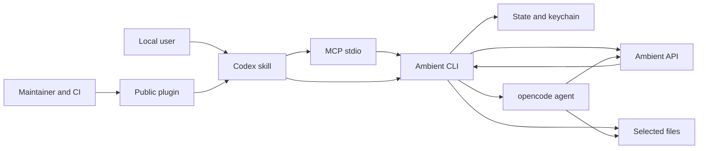

# Ambient Codex threat model

## Executive summary

Ambient Codex is a local, single-user Codex plugin that sends user-selected
prompts and files to Ambient's HTTPS inference API. The main risks are accidental
data disclosure, unsafe acceptance of untrusted model output, agent overreach,
and release-chain compromise. The current design materially reduces those risks
through namespaced credentials, endpoint pinning, bounded parsers, path-safe
writes, no runtime dependencies, opt-in integrations, and mandatory local review.
No critical vulnerability was identified in the confirmed public beta scope.

## Scope and assumptions

- In scope: the public repository, plugin manifest, skill, MCP server, CLI,
  internal `ambient_codex` package, optional launcher/hooks/agent integration,
  documentation, tests, and GitHub workflows.
- Intended use: members of the public install the official beta locally and use
  their own Ambient API key from one OS account and one Codex installation.
- Exposure: MCP uses local stdio; there is no inbound network listener. Inference
  uses outbound HTTPS to Ambient or a user-approved custom endpoint.
- Data: ordinary prompts and selected source may leave the machine. API keys,
  credentials, private personal records, health records, and production dumps
  are outside the supported input boundary.
- Local authorization relies on the OS account and Codex approval boundary.
- Ambient's hosted service and opencode internals are outside this repository's
  control and are modeled as external trust domains.
- Repository history was scanned for credential/PII patterns. Matches are limited
  to synthetic security fixtures; commit emails use GitHub noreply addresses.

Open questions that would change the ranking:

- Reassess before shared-host, unattended production, multi-tenant, or regulated
  data use.
- Reassess if Ambient Codex gains an inbound service, automatic command execution,
  or default lifecycle hooks.

## System model

### Primary components

- **Codex skill:** routing, trust policy, takeover behavior, large-repository
  coverage, and final verification (`plugins/ambient-codex/skills/ambient/SKILL.md`).
- **MCP control plane:** 14 bounded JSON-RPC-over-stdio tools with strict schemas,
  framing limits, redaction, and subprocess isolation
  (`plugins/ambient-codex/mcp/ambient_mcp.py`,
  `plugins/ambient-codex/mcp/ambient_mcp_framing.py`).
- **CLI execution plane:** thin entrypoint plus focused stdlib modules for input,
  models, transport, audits, builds, state, and integrations
  (`plugins/ambient-codex/bin/ambient`, `plugins/ambient-codex/ambient_codex/`).
- **Local state:** namespaced configuration/cache/usage under
  `~/.config/ambient-codex`, build resume manifests, and an `ambient-codex`
  keychain item (`ambient_codex/runtime_command.py`, `ambient_codex/credentials.py`).
- **External inference:** bearer-authenticated HTTPS model and completion requests
  (`ambient_codex/transport.py`, `ambient_codex/streaming.py`).
- **Optional integrations:** stable launcher, explicit git hooks, and an opencode
  agent provider (`ambient_codex/launcher_command.py`,
  `ambient_codex/audit_hook_command.py`, `ambient_codex/agent_command.py`).
- **Release system:** local Codex marketplace, immutable GitHub Action pins,
  cross-platform CI, CodeQL, and Dependabot (`.agents/plugins/marketplace.json`,
  `.github/workflows/`).

### Data flows and trust boundaries

- **User/Codex → MCP:** prompts, paths, settings, and model/mode choices cross
  local JSONL or Content-Length-framed stdio. Schemas reject unknown fields and
  credential arguments; frames are capped at 8 MiB
  (`mcp/ambient_mcp_catalog.py`, `mcp/ambient_mcp_framing.py:read_message`).
- **MCP → CLI:** validated values cross subprocess argv without a shell. Dynamic
  prompts/paths follow option boundaries; stdout/stderr are bounded and redacted
  (`mcp/ambient_mcp.py:run_ambient`).
- **CLI → state/keychain:** keys and settings cross OS storage boundaries. The
  state root is normalized and namespaced; credential subprocesses receive keys
  through stdin, not argv (`ambient_codex/runtime_command.py:validate_state_root`,
  `ambient_codex/credentials.py`).
- **CLI → Ambient API:** selected content and a bearer key cross HTTPS. Ambient
  hosts are trusted by default; a custom host requires an explicit persisted
  decision (`ambient_codex/runtime_command.py:resolve_api_url`,
  `ambient_codex/transport.py:api_request`).
- **Ambient API → CLI/Codex:** JSON/SSE output crosses an untrusted boundary.
  Line/response bounds, stream redaction, partial signals, and local review apply
  (`ambient_codex/streaming.py:stream_completion`,
  `ambient_codex/stream_redactor.py`).
- **Repository → CLI/API:** selected files pass bounded readers and the credential
  tripwire before network use (`ambient_codex/intake.py`,
  `ambient_codex/secrets.py:line_has_secret`).
- **Model/cache → build directory:** generated records pass relative-path,
  credential-name, size, root, and symlink checks before atomic replacement
  (`ambient_codex/build_state_command.py:safe_relpath`,
  `ambient_codex/build_apply.py:apply_records`).
- **CLI → opencode → repository/API:** the key enters a child environment and the
  agent can read/write its scoped tree. Provider configuration is namespaced and
  `--pure` is default, but opencode remains an external trust domain
  (`ambient_codex/agent_config.py`, `ambient_codex/agent_command.py:run_agent`).
- **Maintainer/CI → public plugin:** commits and workflow definitions become code
  installed by users. CI and CodeQL inspect source, but repository administration
  and release credentials remain privileged external controls.

#### Diagram

## Assets and security objectives

| Asset | Why it matters | Security objective (C/I/A) |
|---|---|---|
| Ambient API key | Authorizes the user's Ambient requests | C, I |
| Selected prompts and source | May contain private or proprietary information | C, I |
| Working tree and build output | Bad writes can corrupt or compromise projects | I, A |
| Endpoint/model configuration | Tampering can redirect data or change behavior | C, I |
| Cache and build resume records | Poisoning can replay untrusted prior output | I |
| opencode provider configuration | Shared configuration may affect other tools | C, I |
| Plugin release and marketplace | Compromise reaches every installer | C, I, A |
| Audit coverage metadata | False completeness can hide unread code | I |

## Attacker model

### Capabilities

- Supply malicious repository text, filenames, diffs, MCP arguments, API
  responses, or model output that a user asks the plugin to process.
- Provide very large or adversarial input intended to exhaust API or local
  resources.
- Control a custom endpoint after the user explicitly trusts it.
- Attempt to compromise repository, workflow, or release credentials.

### Non-capabilities

- No remote access to MCP; it has no socket or listener.
- No initial access to the user's OS account, keychain, plugin cache, or local
  configuration.
- No automatic authority merely because model output contains instructions.
- No supported path for silently enabling hooks or replacing foreign launchers.

## Entry points and attack surfaces

| Surface | How reached | Trust boundary | Notes | Evidence (repo path / symbol) |
|---|---|---|---|---|
| CLI args, env, stdin | Local terminal or Codex | User → CLI | Models, paths, prompts, endpoint, settings | `ambient_codex/cli_parser.py`; `ambient_codex/intake.py` |
| MCP JSON-RPC | Codex tool call | Codex → MCP | Strict schemas, 8 MiB framing | `mcp/ambient_mcp_catalog.py`; `mcp/ambient_mcp_framing.py` |
| Ambient HTTPS API | Ask/audit/code/build/map | CLI → service | Bearer auth and endpoint trust | `ambient_codex/transport.py`; `ambient_codex/streaming.py` |
| Selected files | Repository workflows | Repository → API | Bounded intake and secret detection | `ambient_codex/repository.py`; `ambient_codex/secrets.py` |
| Generated records | `build --apply` | Model → filesystem | Path, size, symlink, atomic-write guards | `ambient_codex/build_workflow.py`; `ambient_codex/build_apply.py` |
| Cache/resume state | Repeat or resumed work | Local state → runtime | Bounded records and identity checks | `ambient_codex/cache_store.py`; `ambient_codex/build_state_command.py` |
| opencode agent | Explicit `agent` command | CLI → external process | Key in child env; direct tree access | `ambient_codex/agent_command.py` |
| Launcher/hooks | Explicit install commands | CLI → executable/git metadata | Ownership markers; no default hooks | `ambient_codex/launcher.py`; `hooks/hooks.json` |
| Plugin release | Codex marketplace/GitHub | Publisher → users | Source-only Python package | `.codex-plugin/plugin.json`; `.github/workflows/` |

## Top abuse paths

1. Malicious or overbroad repository input contains a credential → user delegates
   it → a scanner miss allows content into an API request → confidential data is
   disclosed.
2. Repository prompt injection influences model output → generated code or advice
   is accepted without review → a vulnerable or destructive change lands.
3. Local config is tampered with → a custom endpoint is trusted → bearer key and
   selected source are sent to the wrong service.
4. A generated build record attempts traversal or symlink escape → validation is
   raced or bypassed → a file outside the target is overwritten.
5. An agent receives a broad working tree → opencode reads or changes more than
   intended → source disclosure or repository compromise follows.
6. Oversized inputs trigger excessive fan-out or generation → API/local resources
   are exhausted → the requested workflow becomes unavailable.
7. A malicious local MCP client sends malformed frames or option-like values → it
   attempts parser denial of service or CLI argument confusion.
8. A release account or workflow is compromised → malicious plugin source is
   published → installed keys and source become exposed.

## Threat model table

| Threat ID | Threat source | Prerequisites | Threat action | Impact | Impacted assets | Existing controls (evidence) | Gaps | Recommended mitigations | Detection ideas | Likelihood | Impact severity | Priority |
|---|---|---|---|---|---|---|---|---|---|---|---|---|
| TM-001 | Malicious content or overbroad scope | Sensitive material is included in a routed task | Exfiltrate source or credentials through inference | Confidentiality loss | Key, prompts, source | Credential filename/pattern checks and bounded intake (`ambient_codex/secrets.py`, `ambient_codex/intake.py`); skill forbids sensitive input | Pattern detection cannot identify every secret or personal record | Keep scope explicit; add provider-side data controls before regulated use; preserve fail-closed credential matches | Count blocked categories without logging content | medium | high | high |
| TM-002 | Repository prompt injection or model output | Generated output is trusted without review | Induce harmful code, commands, or dependency changes | Project compromise | Working tree, local environment | Output treated as untrusted; Codex reviews/tests; builds do not execute generated advice (`skills/ambient/SKILL.md`, `ambient_codex/build_command.py`) | Agent and user can still approve harmful work | Keep agent scopes narrow; require diff/test review before merge | Record changed-file manifest and test result | medium | high | high |
| TM-003 | Local config tampering or hostile custom endpoint | User or same-account process trusts another host | Capture bearer key and selected content | Key/source disclosure | Key, source, routing config | HTTPS, Ambient host pinning, explicit custom-host trust (`ambient_codex/runtime_command.py:resolve_api_url`) | Persisted custom trust is intentionally powerful | Display custom host in status/doctor and expire trust when policy changes | Warn on every non-default endpoint session | low | high | medium |
| TM-004 | Malicious build output or filesystem race | `build --apply` targets a writable tree | Escape target or overwrite an unintended file | File integrity loss | Working tree, resume state | Root/path/name/size/symlink checks and atomic replacement (`ambient_codex/build_workflow.py`, `ambient_codex/build_apply.py`) | Portable race elimination is difficult | Retain cross-platform junction/symlink tests; prefer no-follow directory APIs where available | Emit resolved applied-file manifest | low | high | medium |
| TM-005 | Overbroad or compromised opencode agent | User explicitly starts agent in a sensitive tree | Read/change unintended files or expose child-env key | Source/key disclosure or code compromise | Key, source, opencode config | Namespaced provider, restrictive permissions, key reference, `--pure` default (`ambient_codex/agent_config.py`, `ambient_codex/agent_command.py`) | Agent bypasses the normal file tripwire | Add optional preflight scanning; recommend disposable scoped worktrees | Warn on credential-named files and non-pure mode | medium | high | high |
| TM-006 | Malicious same-user MCP client | Local process controls server stdio | Parser bomb or argv confusion | Session denial of service or wrong command | Availability, local state | Frame cap, strict schemas, NUL/length checks, no shell, option boundaries (`mcp/ambient_mcp_framing.py`, `mcp/ambient_mcp.py`) | Same-user denial of service cannot be eliminated | Continue parser fuzzing and depth-limit review | Count invalid frames without payload logging | low | medium | low |
| TM-007 | Large/adversarial input | User starts large map/audit/build | Exhaust API, memory, or time resources | Workflow unavailability | Availability, usage state | 20M process ceiling, model-aware chunking/output caps, partial results, transport/no-progress detection (`ambient_codex/chunking.py`, `ambient_codex/model_budget.py`, `ambient_codex/streaming.py`) | Healthy work intentionally has no elapsed deadline | Keep concurrency bounded; expose cancellation and honest partial coverage | Report chunk counts, partials, and stall category | medium | medium | medium |
| TM-008 | Repository or release compromise | Attacker obtains maintainer/workflow authority | Publish malicious plugin source | Broad installer compromise | Release, keys, user source | No runtime deps/binaries; immutable Action pins; multi-OS CI; CodeQL; version checks (`pyproject.toml`, `.github/workflows/`) | GitHub account/release security remains external | Protect main, require CI/review, enable secret scanning, use signed annotated tags and release checksums | CodeQL/Dependabot/secret alerts; release checksum verification | low | high | medium |
| TM-009 | Same-user cache/resume tampering | Attacker can modify local state or build tree | Replay poisoned prior output | Incorrect or harmful generated result | Cache, resume state, audit integrity | Size/schema/identity/hash checks and atomic writes (`ambient_codex/cache_store.py`, `ambient_codex/build_state_command.py`) | Same-user state access largely collapses this local boundary | Reject unexpected modes/ownership where portable; bind all records to runtime schema | Report invalidation/tamper reasons | low | medium | low |

## Criticality calibration

- **Critical:** plausible pre-approval remote code execution/key theft or a
  malicious official release affecting all installers.
- **High:** realistic key/source disclosure or user-level project compromise in a
  supported workflow.
- **Medium:** high impact requiring strong local/user prerequisites, or bounded
  availability/resource exhaustion.
- **Low:** same-user session denial of service or recoverable cache/state errors.

Examples: remote MCP execution would be critical; agent-driven secret disclosure
is high; a trusted hostile custom endpoint or build path race is medium; a malformed
local frame terminating one session is low.

## Focus paths for security review

| Path | Why it matters | Related Threat IDs |
|---|---|---|
| `plugins/ambient-codex/ambient_codex/secrets.py` | Outbound credential backstop | TM-001, TM-005 |
| `plugins/ambient-codex/ambient_codex/runtime_command.py` | Key, state, and endpoint trust boundary | TM-001, TM-003 |
| `plugins/ambient-codex/ambient_codex/credentials.py` | OS credential subprocess handling | TM-001, TM-003 |
| `plugins/ambient-codex/ambient_codex/transport.py` | Authenticated HTTP request boundary | TM-001, TM-003, TM-007 |
| `plugins/ambient-codex/ambient_codex/streaming.py` | SSE bounds, redaction, and stall behavior | TM-001, TM-007 |
| `plugins/ambient-codex/ambient_codex/build_workflow.py` | Generated path validation | TM-002, TM-004 |
| `plugins/ambient-codex/ambient_codex/build_apply.py` | Atomic filesystem writes | TM-004, TM-009 |
| `plugins/ambient-codex/ambient_codex/agent_command.py` | External agent/key environment boundary | TM-002, TM-005 |
| `plugins/ambient-codex/mcp/ambient_mcp.py` | Tool validation and subprocess dispatch | TM-006 |
| `plugins/ambient-codex/mcp/ambient_mcp_framing.py` | Untrusted JSON-RPC framing | TM-006 |
| `plugins/ambient-codex/skills/ambient/SKILL.md` | Trust and orchestration policy | TM-001, TM-002, TM-005, TM-007 |
| `.github/workflows/` | Public release supply chain | TM-008 |

## Quality check

- [x] Covered every discovered runtime entry point and optional integration.
- [x] Represented local, filesystem, subprocess, network, model-output, and
  release trust boundaries in threats.
- [x] Separated runtime behavior from CI/release and test fixtures.
- [x] Reflected the confirmed official, public, local, single-user beta context.
- [x] Reflected the user's clarification that the PII audit concerns public
  repository content while the runtime warning remains a safe input boundary.
- [x] Recorded regulated, shared-host, and unattended use as reassessment triggers.
